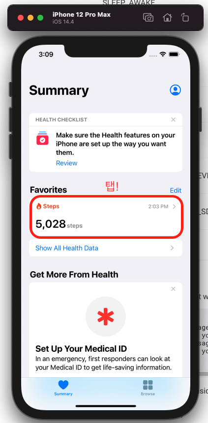
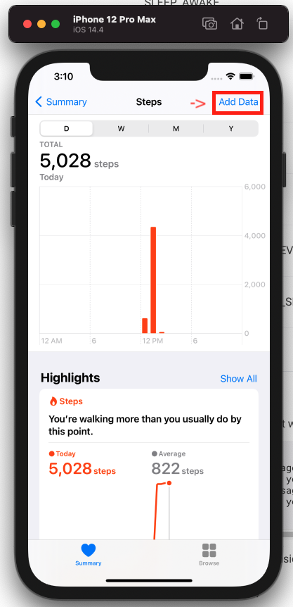
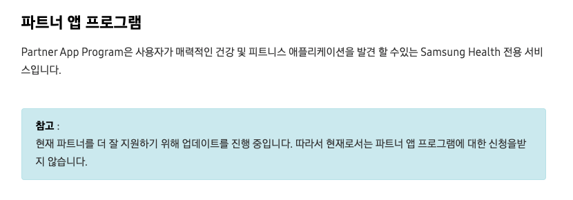

# pedometer_sample

만보계 기능을 위한 샘플 앱
- [x] null safety
- [x] flutter version: 2.0.4 (stable channel)

---

## Google Fitness & Apple Health Kit

#### 사용한 플러그인: [health: 3.0.5](https://pub.dev/packages/health)

[API reference](https://pub.dev/documentation/health/latest/health/HealthFactory-class.html)

구글 피트니스의 경우, 전체적으로 RESTful API 컨셉을 가진다. google fitness의 정보를 필요로 하는 어플리케이션에서 Google Cloud Platform을 이용한 통신을 사용한다. 어플리케이션 간의 직접적인 통신이 아니라 미들웨어를 거쳐 진행되기에 GCP의 인증 절차가 필수적이다.

 1. 구글 피트니스를 실행하기 위해서는 인터넷 연결이 필수이다.
    - 인터넷 연결 상태 확인 필요
    - 인터넷 연결 없을 경우 유즈케이스 필요
 2. GCP에 등록 후 사용가능하다.
    - GCP를 사용하기 떄문에 API 사용설정이 필요하다. [GCP 설정링크](https://console.developers.google.com/flows/enableapi?apiid=fitness)
    - 샘플앱 실행 전에 박성진 사원에게 기기의 로그인된 구글 아이디를 전달해주세요. 테스트 모드이기에 사용자등록을 해야합니다.

#### plug-in feature

- 주요 클래스: ```HealthFactory```
- 주요 메서드  
    1. ```getHealthDataFromTypes()```: 언제부터 언제까지의 어떤 데이터를 받아올지 설정하면 해당되는 데이터를 받아오는 함수.
    2. ```requestAuthorization()```: 피트니스 데이터에 대한 접근 권한 획득하는 함수
        - WARNING.. 플러그인 내부에서 에러 발생으로 정상 동작하지 않음. 권한 받아오는 과정에서 진행 안됨.
        - ***따라서 Method Channel을 통해 관련 기능 따로 구현*** 
        - 기기에 대한 권한을 얻는것이 아니라 특정 아이디에 대한 권한을 획득하는 과정이기 떄문에 어플을 삭제 후 재설치 후에도 동일 아이디에 대해서는 이전 결과 획득


#### ANDROID

> 플러그인의 안드로이드 코드에러로 메서드 채널을 통해 구현.

사용을 위해 필요한 권한 및 인증은 2가지이다. 
1. 기기의 접근 권한
    - ```Manifest```에  ```<uses-permission android:name="android.permission.ACTIVITY_RECOGNITION"/>```을 추가해야한다. 
    - 안드로이드 버전 10 이상부터 활동에 대한 정보에 접근하기 위해서는 동적 권한 요청이 필요하다. 
2. GCP의 인증절차
    - ```requestAuthorization()```를 통한 GCP인증단계.
    - 일일별 걸음수를 가져오는 권한은 따로 OAuth 다이얼로그가 생성되지 않는다.

데이터를 가져오는 방식을 오늘자의 기록을 가져오는 기능만을 구현한다.
google fitness의 공식문서에 따르면 특정 시점부터 자동 기록을 할 수도 있으며, 세션을 열어서 fitness 데이터에 대한 CRUD가 가능하다. 


#### iOS

플러그인의 ```README.md```에 명시된 것 처럼 2가지의 준비과정이 있다.
1. ```Signing & Capabilities```에서 HealthKit capability 추가
2. ```info.plist```에 퍼미션 작성

``` xml
<key>NSHealthShareUsageDescription</key>
<string>We will sync your data with the Apple Health app to give you better insights</string>
<key>NSHealthUpdateUsageDescription</key>
<string>We will sync your data with the Apple Health app to give you better insights</string>
```

iOS에서는 에러없이 잘 동작한다. simulator에서 테스트하기 위해서는 simulator에 데이터를 넣어두어야 한다. 




---

## Samsung Health

#### 사용한 플러그인: [samsung_health_handler 0.2.7](https://pub.dev/packages/samsung_health_handler)

[API reference](https://pub.dev/documentation/samsung_health_handler/latest/)

- null safety 미지원
- 작년 7월이후 업데이트 없음
- 현재 git hub repository의 코드는 작성중인 상태

삼성 헬스를 사용하기 위해서는 삼성 헬스의 파트너쉽을 등록해야 한다. 그러나 현재 내부 서비스 업데이트 인해서 서비스를 중단하고 있다.



때문에 더이상 테스트는 사실상 불가능하다. [samsung health API refrence](https://img-developer.samsung.com/onlinedocs/health/android/data/index.html)에 의하면 특정 기간을 기점으로, 해당 기점 이후의 데이터를 받아오는 기능은 구현가능하다. 일정 시간 간격으로 반복적으로 호출해서 데이터를 얻어올 수는 있지만, 스트림을 열거나 실시간 걸음수 변경에 대한 스트림을 열지는 못한다.

---

## summary

#### 3-Party App과의 연동시 장,단점 

__장점__
- 손쉬운 데이터 수집
- 데이터 신뢰도 구축
- 초기 개발에 대한 비용감소

__단점__
- 제약 조건 발생 (어플 설치 및 인터넷 연결)
- 권한이나 인증시의 플로우로 인한 유저 이탈가능성 (높은 초기 진입장벽)
- 3-party vender에 종속적인 유지보수